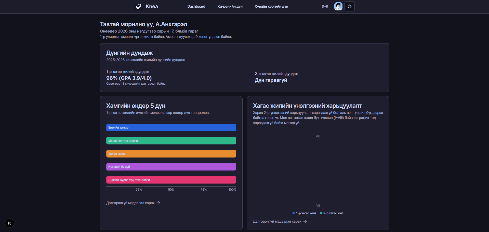
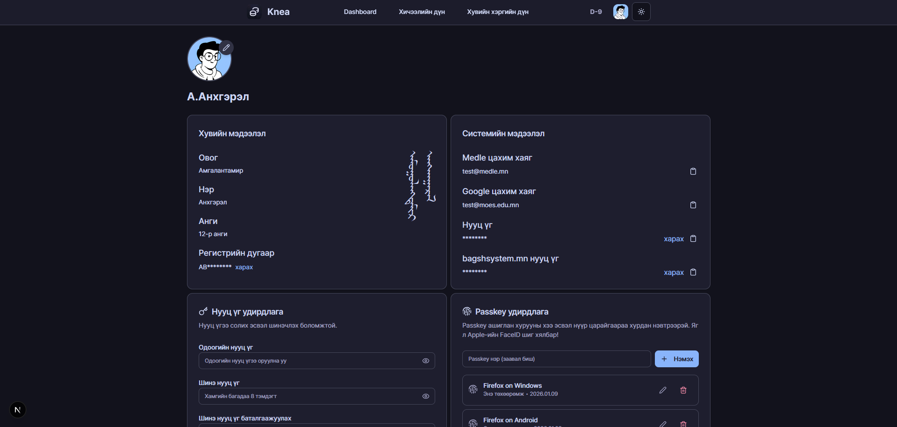
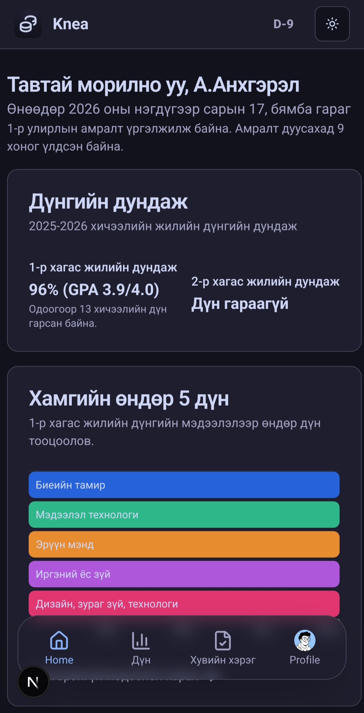
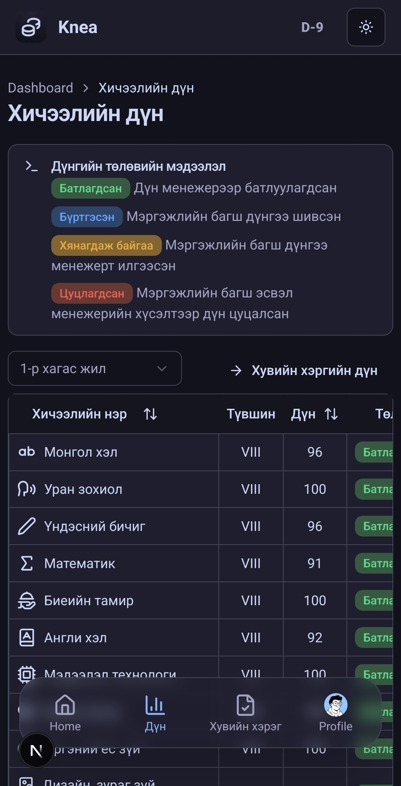
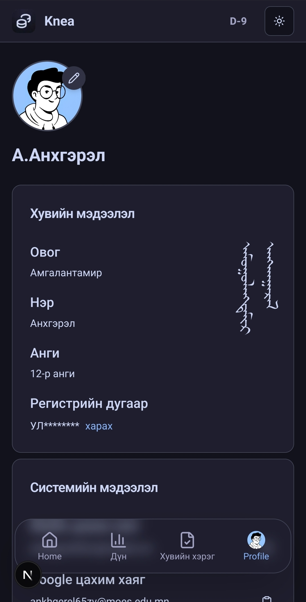

# Knea - Grade transcript

**Knea - Grade transcript** нь Монголын сурагчдад зориулсан сурлагын дүнгийн мэдээллээ хянах, удирдах вэб програм юм. Энэхүү програм нь Боловсролын Яамны албан ёсны ESIS API-тай аюулгүй холбогдож, дүнгийн мэдээллийг хэрэглэгчдэд ээлтэй хяналтын самбарт харуулдаг.

## Онцлог

*   **ESIS-тэй аюулгүй холбогдох:** ESIS API-г ашиглан сурагчийн дүнгийн мэдээллийг аюулгүй татаж авах.
*   **Интерактив хяналтын самбар:** Дүн, голч дүн, сурлагын ахиц дэвшлээ ойлгомжтой, харагдахуйц хяналтын самбараас харах.
*   **Улирлын дүнгийн түүх:** Улирал бүрийн сурлагын амжилтаа хянах.
*   **Орчин үеийн & Төхөөрөмжид таарсан UI:** Компьютер, таблет, ухаалаг утас гээд ямар ч төхөөрөмжөөс дүнгээ харах боломжтой.
*   **Харанхуй горим:** Дэлгэцийг тав тухтай харахын тулд цайвар болон харанхуй горим хооронд шилжих.

---

## Дэлгэцийн зураг

### Компьютер

| Хяналтын самбар | Профайл |
|-----------------|---------|
|  |  |

### Гар утас

| Хяналтын самбар | Дүнгүүд | Профайл |
|-----------------|---------|---------|
|  |  |  |

---

## Технологийн стек

*   **Framework:** [Next.js](https://nextjs.org/) (React)
*   **Monorepo:** [Turborepo](https://turbo.build/) & [pnpm](https://pnpm.io/)
*   **Өгөгдлийн сангийн ORM:** [Prisma](https://www.prisma.io/)
*   **UI:** [shadcn/ui](https://ui.shadcn.com/), [Tailwind CSS](https://tailwindcss.com/)
*   **Хэл:** [TypeScript](https://www.typescriptlang.org/)
*   **Кодын чанар:** [BiomeJS](https://biomejs.dev/) (Linting, Formatting)

---

## Ашиглаж эхлэх

Энэхүү төслийг өөрийн компьютерт хуулж, хөгжүүлэлт болон туршилтын орчинд ажиллуулахын тулд доорх зааврыг дагана уу.

### Шаардлагатай зүйлс

*   [Node.js](https://nodejs.org/en/) (v18 ба түүнээс дээш)
*   [pnpm](https://pnpm.io/installation)

### Суулгах заавар

1.  **Төслийг хуулж авах:**
    ```bash
    git clone https://github.com/your-username/grade-transcript.git
    cd grade-transcript
    ```

2.  **Шаардлагатай сангуудыг суулгах:**
    ```bash
    pnpm install
    ```

3.  **Орчны хувьсагчдыг тохируулах:**
    `apps/web` хавтаст `.env` нэртэй файл үүсгэж, ESIS API-д шаардлагатай орчны хувьсагчдыг нэмнэ үү.
    ```env
    ESIS_API_KEY=your_api_key
    DATABASE_URL="your_database_url"
    ```

4.  **Өгөгдлийн сангийн шилжүүлгийг ажиллуулах:**
    ```bash
    pnpm db:push
    ```

5.  **Хөгжүүлэлтийн серверийг ажиллуулах:**
    ```bash
    pnpm dev
    ```

Хөтөч дээрээ [http://localhost:3000](http://localhost:3000) хаягаар орж үр дүнг харна уу.

---

## Төслийн бүтэц

Энэхүү төсөл нь pnpm workspaces ашигласан monorepo бүтэцтэй.

*   `apps/web`: Үндсэн Next.js вэб програм.
*   `packages/database`: Prisma схем ба өгөгдлийн сангийн клиент.
*   `packages/esis`: Монголын ESIS API-тай харьцах зориулалттай сан.
*   `packages/tsconfig`: Дундын TypeScript тохиргоонууд.


---

## 📄 Лиценз

Энэхүү төсөл нь MIT лицензээр лицензлэгдсэн болно.
